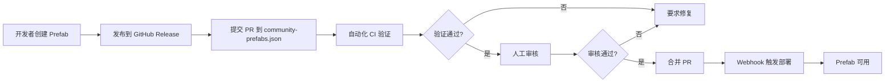

# Prefab 生态系统

> GTPlanner 的 AI 预制件生态系统 - 构建、发布和共享可复用的 AI 功能组件

## 📖 概述

Prefab（预制件）生态系统是 GTPlanner 项目的重要组成部分，致力于为 AI 应用提供标准化、可复用的功能模块。通过 Prefab，开发者可以轻松地将各种功能集成到自己的 AI 工作流中。

## 🏗️ 组织结构

```
prefabs/
├── README.md              # 本文档 - 生态系统总览
├── releases/              # 发布索引与管理
│   ├── community-prefabs.json  # 中央索引文件
│   ├── scripts/           # 验证和管理脚本
│   ├── CONTRIBUTING.md    # 贡献指南
│   └── README.md          # 发布流程文档
```

## 🎯 快速开始

### 对于用户：使用 Prefab

Prefab 可以通过 GTPlanner 的前端界面或 API 直接调用。每个 Prefab 都提供标准化的输入输出接口，无需了解内部实现细节。

**通过前端使用：**
1. 访问 GTPlanner 前端界面
2. 浏览 Prefab 市场
3. 选择需要的 Prefab 并提供参数
4. 执行并获取结果

**通过 API 使用：**
```bash
curl -X POST "https://api.example.com/v1/prefabs/{prefab-id}/run" \
  -H "Content-Type: application/json" \
  -d '{
    "version": "1.0.0",
    "inputs": {...}
  }'
```

### 对于开发者：创建 Prefab

1. **使用官方模板：**
   ```bash
   git clone https://github.com/The-Agent-Builder/Prefab-Template.git my-prefab
   cd my-prefab
   uv sync --dev
   ```

2. **开发功能：**
   - 编辑 `src/main.py` 实现你的函数
   - 更新 `prefab-manifest.json` 描述函数接口
   - 编写测试确保质量

3. **发布到生态系统：**
   - 在你的仓库创建 Release
   - 提交 PR 到 `prefabs/releases/community-prefabs.json`
   - 等待审核和自动部署

详细步骤请参考 [releases/CONTRIBUTING.md](releases/CONTRIBUTING.md)

### 对于贡献者：发布 Prefab

**前置条件：**
- 已使用 [Prefab-Template](https://github.com/The-Agent-Builder/Prefab-Template) 创建并测试你的预制件
- 在你的 GitHub 仓库创建了 Release 并上传了 `.whl` 文件

**发布流程：**
1. Fork GTPlanner 仓库
2. 编辑 `prefabs/releases/community-prefabs.json`
3. 添加你的预制件条目
4. 提交 Pull Request
5. 等待自动验证和人工审核
6. 审核通过后自动部署

完整的贡献指南：[releases/CONTRIBUTING.md](releases/CONTRIBUTING.md)

## 🔍 浏览已发布的 Prefab

查看所有可用的预制件：
```bash
cat prefabs/releases/community-prefabs.json | jq '.'
```

按类别搜索：
```bash
# 查找视频处理相关的预制件
cat prefabs/releases/community-prefabs.json | jq '.[] | select(.tags[] | contains("video"))'

# 查找特定作者的预制件
cat prefabs/releases/community-prefabs.json | jq '.[] | select(.author=="username")'
```

## 📚 核心文档

### 使用文档
- [发布仓库 README](releases/README.md) - 了解发布系统工作原理
- [快速开始指南](releases/QUICKSTART.md) - 快速上手指南
- [索引文件规范](releases/README.md#索引文件规范) - community-prefabs.json 格式说明

### 开发文档
- [贡献指南](releases/CONTRIBUTING.md) - 如何贡献你的预制件
- [Prefab 模板](https://github.com/The-Agent-Builder/Prefab-Template) - 官方模板仓库
- [验证脚本](releases/scripts/) - 本地验证工具

### 架构文档
- [产品需求文档](releases/prd.md) - 发布系统的设计理念
- [安全性指南](releases/SECURITY.md) - 安全最佳实践

## 🛡️ 质量保证

### 自动化验证
每个提交的 Prefab 都会经过严格的自动化检查：
- ✅ JSON Schema 验证
- ✅ URL 可达性检查
- ✅ Manifest 一致性验证
- ✅ 重复条目检测

### 人工审核
维护者会审查：
- 代码质量和安全性
- 功能描述准确性
- 贡献者信誉
- 生态系统兼容性

## 🌟 生态统计

```bash
# 查看已发布的预制件数量
cat prefabs/releases/community-prefabs.json | jq 'length'

# 按作者统计
cat prefabs/releases/community-prefabs.json | jq -r '.[].author' | sort | uniq -c | sort -rn

# 最受欢迎的标签
cat prefabs/releases/community-prefabs.json | jq -r '.[].tags[]' | sort | uniq -c | sort -rn
```

## 🔧 技术架构

### 发布流程


### 核心组件
- **索引文件**：`community-prefabs.json` - 所有已发布预制件的元数据
- **验证脚本**：`releases/scripts/` - 自动化验证工具
- **GitHub Actions**：自动化 CI/CD 流程
- **部署服务**：接收 Webhook 并自动部署新版本

## 🤝 社区贡献

我们欢迎各种形式的贡献：

### 🔧 贡献 Prefab
分享你的创意和实现，让更多人受益。参考 [releases/CONTRIBUTING.md](releases/CONTRIBUTING.md)。

### 📝 改进文档
发现文档问题或有改进建议？欢迎提交 PR。

### 🐛 报告问题
在使用 Prefab 时遇到问题？请创建 Issue 描述问题。

### 💬 参与讨论
加入 GitHub Discussions 与社区交流。

## 📊 示例 Prefab

以下是一些典型的 Prefab 类别：

### 媒体处理
- 视频转音频转换器
- 图片背景去除
- 音频降噪处理

### 数据处理
- PDF 文本提取
- Excel 数据分析
- JSON/XML 转换

### AI 集成
- 文本生成
- 图像识别
- 语音合成

### 工具集成
- 天气查询 (如 [Amap-Weather](../../Amap-Weather/))
- 地图服务
- 通知推送

## 📞 获取帮助

- 🐛 **报告问题**：[GitHub Issues](https://github.com/OpenSQZ/GTPlanner/issues)
- 💬 **讨论交流**：[GitHub Discussions](https://github.com/OpenSQZ/GTPlanner/discussions)
- 📖 **文档中心**：[releases/DOCS_INDEX.md](releases/DOCS_INDEX.md)

## 📄 许可证

本生态系统采用 MIT 许可证，鼓励开源和共享。具体请查看 [releases/LICENSE](releases/LICENSE)。

---

**让我们一起构建更强大的 AI 预制件生态系统！** 🚀

