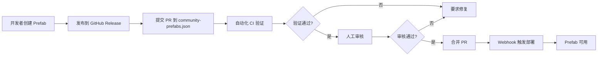

# Prefab 生态系统

**Language**: [English](README.md) | [简体中文](README_zh.md) | [日本語](README_ja.md)

---

> GTPlanner 的 AI 预制件生态系统 - 构建、发布和共享可复用的 AI 功能组件

## 📖 概述

Prefab（预制件）生态系统是 GTPlanner 项目的重要组成部分，致力于为 AI 应用提供标准化、可复用的功能模块。通过 Prefab，开发者可以轻松地将各种功能集成到自己的 AI 工作流中。

### 🎯 Prefab 如何增强 GTPlanner？

当你向 `community-prefabs.json` 贡献 Prefab 后，GTPlanner 会：

1. **📋 智能推荐**
   - 在生成规划时，根据需求自动识别适用的 Prefab
   - 基于功能描述、标签和上下文进行匹配
   - 在 PRD 文档中推荐使用

2. **🔗 无缝集成**
   - 提供标准化的集成代码示例
   - 自动生成 Prefab 调用说明
   - 包含依赖安装指引

3. **💡 方案优化**
   - 减少从零开发的时间
   - 提高方案的可行性
   - 基于社区验证的最佳实践

**示例场景：**
```
需求：创建一个视频分析助手

GTPlanner 规划输出：
├── 核心功能模块
│   ├── 视频字幕提取 ← 推荐使用 video-subtitle-extractor Prefab
│   ├── 文本摘要生成 ← 推荐使用 text-summarizer Prefab
│   └── 关键帧提取 ← 推荐使用 video-keyframe Prefab
├── 数据存储
└── API 接口
```

## 🏗️ 组织结构

```
prefabs/
├── README.md              # 本文档 - 生态系统总览
├── releases/              # 发布索引与管理
│   ├── community-prefabs.json  # 中央索引文件
│   ├── scripts/           # 验证和管理脚本
│   ├── CONTRIBUTING.md    # 贡献指南
│   └── README.md          # 发布流程文档
```

## 快速开始

### 对于用户：使用 Prefab

Prefab 通过 **Prefab Gateway（预制件网关）** 提供统一的调用接口。所有 Prefab 都遵循标准化的输入输出规范，无需了解内部实现细节。

#### 获取 API Key

1. 访问 [AgentBuilder 平台](https://the-agent-builder.com/api-keys)
2. 注册/登录账号
3. 在控制台创建 API Key
4. 保存你的 Key（仅显示一次）

#### 通过网关调用 Prefab

**基本调用格式：**
```bash
curl -X POST "https://gateway.agentbuilder.com/v1/prefabs/{prefab-id}/execute" \
  -H "Authorization: Bearer YOUR_API_KEY" \
  -H "Content-Type: application/json" \
  -d '{
    "function": "function_name",
    "parameters": {
      "param1": "value1",
      "param2": "value2"
    }
  }'
```

**示例：调用天气查询 Prefab**
```bash
curl -X POST "https://gateway.agentbuilder.com/v1/prefabs/amap-weather/execute" \
  -H "Authorization: Bearer sk_abc123..." \
  -H "Content-Type: application/json" \
  -d '{
    "function": "get_weather",
    "parameters": {
      "city": "北京",
      "type": "base"
    }
  }'
```

**响应示例：**
```json
{
  "success": true,
  "result": {
    "city": "北京",
    "weather": "晴",
    "temperature": "25°C",
    "humidity": "45%"
  },
  "execution_time": "0.5s"
}
```

#### 使用 Prefab SDK（开发中）

> SDK 正在开发中，敬请期待

未来将提供多语言 SDK，让调用更简单：

```python
# Python SDK (即将推出)
from prefab_sdk import PrefabClient

client = PrefabClient(api_key="YOUR_API_KEY")
result = client.execute("amap-weather", "get_weather", {
    "city": "北京",
    "type": "base"
})
print(result)
```

```javascript
// JavaScript SDK (规划中)
const client = new PrefabClient({ apiKey: 'YOUR_API_KEY' });
const result = await client.execute('amap-weather', 'get_weather', {
  city: '北京',
  type: 'base'
});
```

### 对于开发者：创建 Prefab

1. **使用官方模板：**
   ```bash
   git clone https://github.com/The-Agent-Builder/Prefab-Template.git my-prefab
   cd my-prefab
   uv sync --dev
   ```

2. **开发功能：**
   - 编辑 `src/main.py` 实现你的函数
   - 更新 `prefab-manifest.json` 描述函数接口
   - 编写测试确保质量

3. **发布到生态系统：**
   - 在你的仓库创建 Release
   - 提交 PR 到 `prefabs/releases/community-prefabs.json`
   - 等待审核和自动部署

详细步骤请参考 [releases/CONTRIBUTING_zh.md](releases/CONTRIBUTING_zh.md)

### 对于贡献者：发布 Prefab

**前置条件：**
- 已使用 [Prefab-Template](https://github.com/The-Agent-Builder/Prefab-Template) 创建并测试你的预制件
- 在你的 GitHub 仓库创建了 Release 并上传了 `.whl` 文件

**发布流程：**
1. Fork GTPlanner 仓库
2. 编辑 `prefabs/releases/community-prefabs.json`
3. 添加你的预制件条目
4. 提交 Pull Request
5. 等待自动验证和人工审核
6. 审核通过后自动部署

完整的贡献指南：[releases/CONTRIBUTING_zh.md](releases/CONTRIBUTING_zh.md)

## 浏览已发布的 Prefab

查看所有可用的预制件：
```bash
cat prefabs/releases/community-prefabs.json | jq '.'
```

按类别搜索：
```bash
# 查找视频处理相关的预制件
cat prefabs/releases/community-prefabs.json | jq '.[] | select(.tags[] | contains("video"))'

# 查找特定作者的预制件
cat prefabs/releases/community-prefabs.json | jq '.[] | select(.author=="username")'
```

## 📚 核心文档

### 使用文档
- [中心索引](releases/community-prefabs.json) - 查看所有已发布的 Prefab
- [Schema 定义](releases/schema.json) - JSON Schema 规范

### 开发文档
- [贡献指南](releases/CONTRIBUTING_zh.md) - 如何贡献你的预制件
- [Prefab 模板](https://github.com/The-Agent-Builder/Prefab-Template) - 官方模板仓库
- [验证脚本](releases/scripts/) - 本地验证工具

## 质量保证

### 自动化验证
每个提交的 Prefab 都会经过严格的自动化检查：
- JSON Schema 验证
- URL 可达性检查
- Manifest 一致性验证
- 重复条目检测

### 人工审核
维护者会审查：
- 代码质量和安全性
- 功能描述准确性
- 贡献者信誉
- 生态系统兼容性

## 生态统计

```bash
# 查看已发布的预制件数量
cat prefabs/releases/community-prefabs.json | jq 'length'

# 按作者统计
cat prefabs/releases/community-prefabs.json | jq -r '.[].author' | sort | uniq -c | sort -rn

# 最受欢迎的标签
cat prefabs/releases/community-prefabs.json | jq -r '.[].tags[]' | sort | uniq -c | sort -rn
```

## 技术架构

### 发布流程


### 核心组件
- **索引文件**：`community-prefabs.json` - 所有已发布预制件的元数据
- **验证脚本**：`releases/scripts/` - 自动化验证工具
- **GitHub Actions**：自动化 CI/CD 流程
- **部署服务**：接收 Webhook 并自动部署新版本

## 社区贡献

我们欢迎各种形式的贡献：

### 贡献 Prefab
分享你的创意和实现，让更多人受益。参考 [releases/CONTRIBUTING_zh.md](releases/CONTRIBUTING_zh.md)。

### 改进文档
发现文档问题或有改进建议？欢迎提交 PR。

### 报告问题
在使用 Prefab 时遇到问题？请创建 Issue 描述问题。

### 参与讨论
加入 GitHub Discussions 与社区交流。

## 示例 Prefab

以下是一些典型的 Prefab 类别和实际示例：

### 媒体处理类
- **视频处理** ([Video-processing](../../Video-processing/))
  - 视频格式转换
  - 字幕提取和生成
  - 关键帧提取
- **音频处理**
  - 音频降噪
  - 语音转文字
  - 音频格式转换
- **图像处理**
  - 图片压缩优化
  - 背景去除
  - 格式转换

### 文档处理类
- **PDF 工具**
  - 文本提取
  - 表格识别
  - PDF 转 Markdown
- **Office 文档**
  - Word/Excel 解析
  - 数据提取和分析
  - 格式转换

### AI 服务类
- **文本处理**
  - 智能摘要生成
  - 文本分类
  - 情感分析
- **图像识别**
  - 物体检测
  - 图片描述生成
  - OCR 文字识别
- **语音处理**
  - 语音合成
  - 语音识别
  - 声纹识别

### API 集成类
- **地理位置**
  - 天气查询 ([Amap-Weather](../../Amap-Weather/))
  - 地图服务
  - 地理编码
- **通知服务**
  - 邮件发送
  - 短信推送
  - WebHook 调用
- **数据服务**
  - 汇率查询
  - 新闻聚合
  - 数据分析

### 业务工具类
- **数据处理**
  - 数据清洗
  - 格式转换
  - 数据验证
- **自动化**
  - 任务调度
  - 工作流执行
  - 批量处理

## 实际使用场景

### 场景 1：智能文档助手

**需求：** 创建一个 PDF 分析助手

**GTPlanner 推荐的 Prefab：**
```json
{
  "prefabs": [
    {
      "name": "pdf-text-extractor",
      "usage": "提取 PDF 文本内容"
    },
    {
      "name": "text-summarizer", 
      "usage": "生成文档摘要"
    },
    {
      "name": "qa-generator",
      "usage": "基于文档内容实现问答"
    }
  ]
}
```

### 场景 2：视频分析工具

**需求：** 构建视频内容分析系统

**GTPlanner 推荐的 Prefab：**
```json
{
  "prefabs": [
    {
      "name": "video-subtitle-extractor",
      "usage": "提取视频字幕"
    },
    {
      "name": "keyframe-extractor",
      "usage": "提取关键帧"
    },
    {
      "name": "image-description",
      "usage": "生成图片描述"
    }
  ]
}
```

### 场景 3：数据分析助手

**需求：** Excel 数据自动分析

**GTPlanner 推荐的 Prefab：**
```json
{
  "prefabs": [
    {
      "name": "excel-parser",
      "usage": "解析 Excel 文件"
    },
    {
      "name": "data-cleaner",
      "usage": "数据清洗和预处理"
    },
    {
      "name": "chart-generator",
      "usage": "生成可视化图表"
    }
  ]
}
```

## 获取帮助

- **报告问题**：[GitHub Issues](https://github.com/wang316902972/GTPlanner/issues)
- **讨论交流**：[GitHub Discussions](https://github.com/wang316902972/GTPlanner/discussions)

## 许可证

本生态系统采用 MIT 许可证，鼓励开源和共享。具体请查看 [LICENSE](../LICENSE.md)。

---

**让我们一起构建更强大的 AI 预制件生态系统！**

