# GTPlanner 完整系统架构设计文档

基于设计模式原则和现有代码分析，为GTPlanner设计一个清晰、可扩展的完整系统架构。本文档涵盖了整个项目的架构设计，确保后续开发工作能够基于统一的架构规范进行。

## 📋 目录

1. [系统概览](#系统概览)
2. [核心架构原则](#核心架构原则)
3. [整体架构设计](#整体架构设计)
4. [核心组件架构](#核心组件架构)
5. [设计模式应用](#设计模式应用)
6. [API层架构](#api层架构)
7. [数据流架构](#数据流架构)
8. [配置管理架构](#配置管理架构)
9. [部署架构](#部署架构)
10. [请求验证系统](#请求验证系统)

---

## 🎯 系统概览

GTPlanner是一个基于ReAct模式的智能任务规划系统，采用现代化的微服务架构和流式响应设计。系统支持多语言、多模态的智能规划，具备完整的工具生态和扩展能力。

### 核心特性

- **智能规划**：基于ReAct模式的智能任务分解和流程生成
- **流式响应**：Server-Sent Events (SSE) 实时响应系统
- **多语言支持**：支持中文、英文、日文、西班牙文、法文
- **工具生态**：完整的工具推荐和调用系统
- **无状态设计**：支持高并发和水平扩展
- **模块化架构**：基于设计模式的可扩展架构

### 技术栈

- **后端框架**：FastAPI + Uvicorn
- **AI框架**：OpenAI API + 自定义Agent系统
- **流式处理**：PocketFlow + 自定义流式架构
- **数据存储**：SQLite + 向量数据库
- **配置管理**：Dynaconf + TOML
- **工具集成**：MCP (Model Context Protocol)

---

## 🏛️ 核心架构原则

### 1. SOLID原则
- **单一职责原则**：每个组件只负责一个明确的功能
- **开闭原则**：对扩展开放，对修改封闭
- **里氏替换原则**：子类可以完全替换父类
- **接口隔离原则**：依赖于抽象而不是具体实现
- **依赖倒置原则**：高层模块不依赖低层模块

### 2. 架构设计原则
- **无状态设计**：组件间通过数据传递，不维护内部状态
- **流式优先**：支持实时响应和渐进式数据传输
- **模块化设计**：高内聚、低耦合的组件设计
- **可扩展性**：支持水平扩展和功能扩展
- **容错性**：优雅的错误处理和恢复机制

---

## 🏗️ 整体架构设计

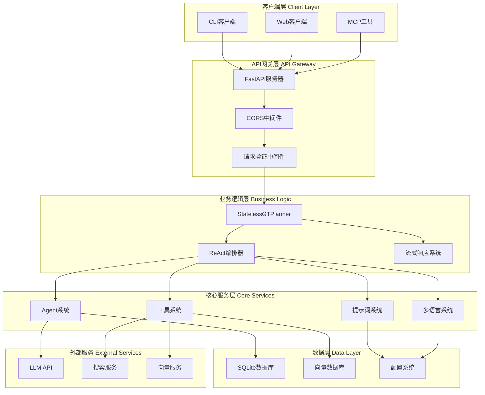

---

## 🧩 核心组件架构

### 1. Agent系统架构

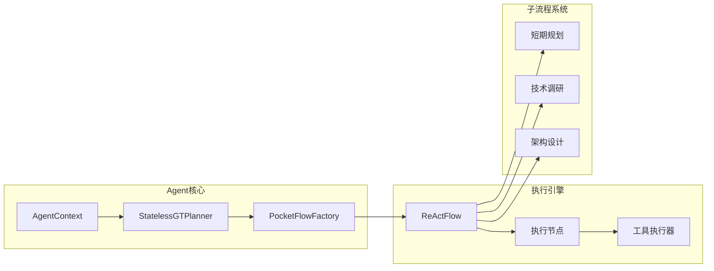

#### Agent系统组件职责

- **AgentContext**：无状态上下文数据结构
- **StatelessGTPlanner**：无状态规划器主控制器
- **PocketFlowFactory**：数据转换工厂
- **ReActFlow**：ReAct模式编排器
- **ExecutionNode**：原子操作执行节点
- **ToolExecutor**：工具调用执行器

### 2. 流式响应系统架构

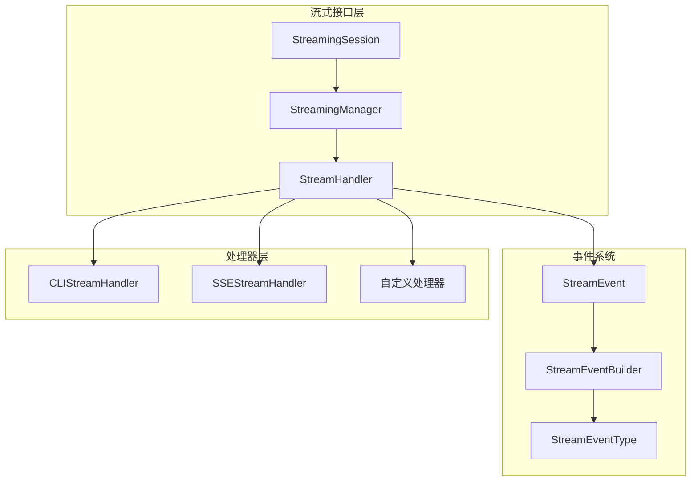

### 3. 工具系统架构

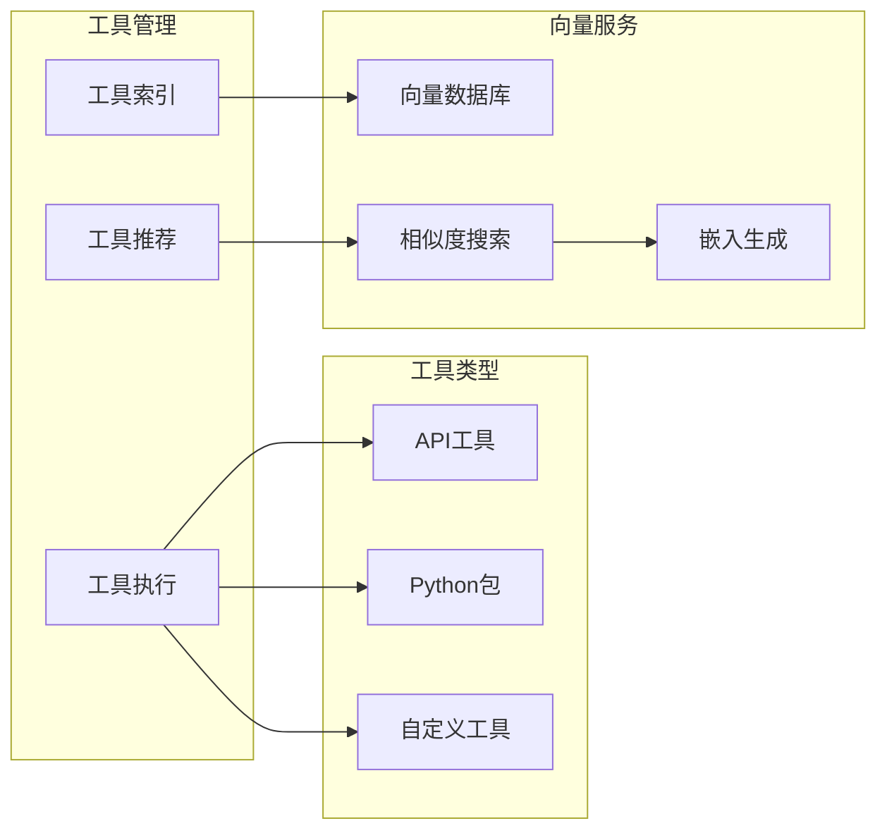

### 4. 持久化系统架构

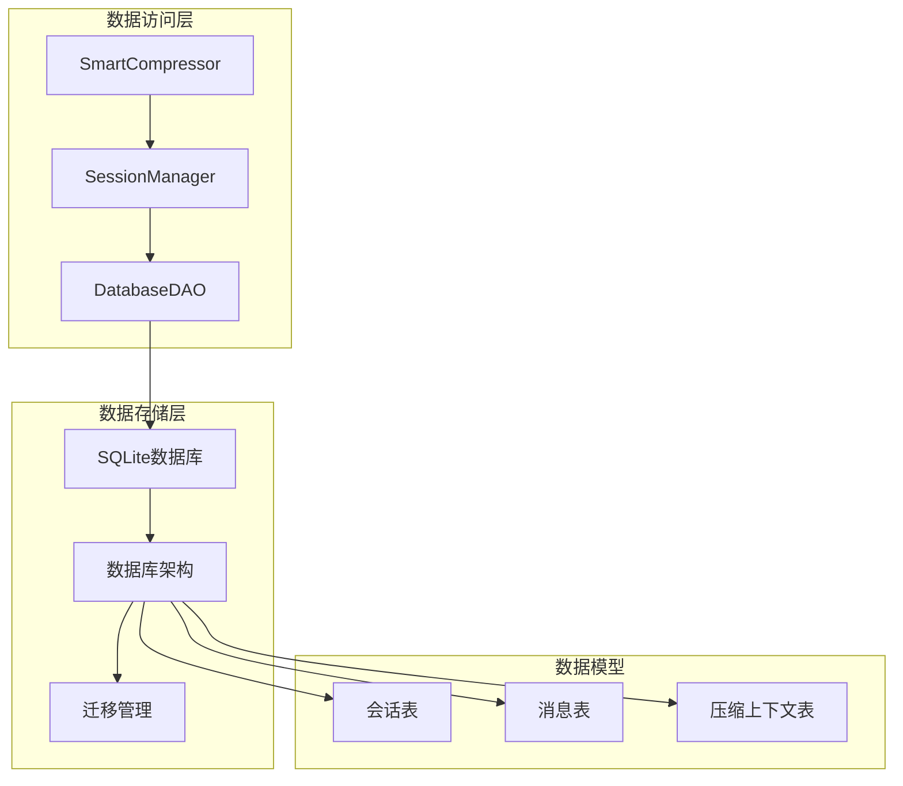

---

## 🎨 设计模式应用

### 1. 创建型模式

#### 工厂模式 (Factory Pattern)
- **PocketFlowFactory**：负责AgentContext和shared字典的转换
- **ValidatorFactory**：创建不同类型的验证器
- **PromptFactory**：创建多语言提示词模板

#### 单例模式 (Singleton Pattern)
- **PromptManager**：全局提示词管理器
- **StreamingManager**：全局流式响应管理器
- **ConfigManager**：全局配置管理器

### 2. 结构型模式

#### 装饰器模式 (Decorator Pattern)
- **ValidationMiddleware**：请求验证装饰器
- **StreamingDecorator**：流式响应装饰器
- **TracingDecorator**：执行追踪装饰器

#### 适配器模式 (Adapter Pattern)
- **LLMAdapter**：不同LLM服务的适配器
- **DatabaseAdapter**：不同数据库的适配器
- **ToolAdapter**：不同工具类型的适配器

### 3. 行为型模式

#### 策略模式 (Strategy Pattern)
- **ValidationStrategy**：不同的验证策略
- **CompressionStrategy**：不同的压缩策略
- **LanguageStrategy**：不同的语言处理策略

#### 责任链模式 (Chain of Responsibility)
- **ValidationChain**：验证责任链
- **MiddlewareChain**：中间件责任链
- **ProcessingChain**：处理流程责任链

#### 观察者模式 (Observer Pattern)
- **StreamEventObserver**：流式事件观察者
- **ValidationObserver**：验证事件观察者
- **MetricsObserver**：指标收集观察者

#### 模板方法模式 (Template Method Pattern)
- **BaseValidator**：验证器基类模板
- **BaseNode**：节点执行模板
- **BaseHandler**：处理器基类模板

---

## 🌐 API层架构

### 1. RESTful API设计

```python
# 主要API端点设计
@app.post("/api/chat/agent")
async def chat_agent_stream(request: AgentContextRequest):
    """SSE流式聊天端点 - GTPlanner Agent"""
    pass

@app.get("/health")
async def health_check():
    """健康检查端点"""
    pass

@app.get("/api/status")
async def api_status():
    """获取详细的API状态信息"""
    pass
```

#### API层组件设计

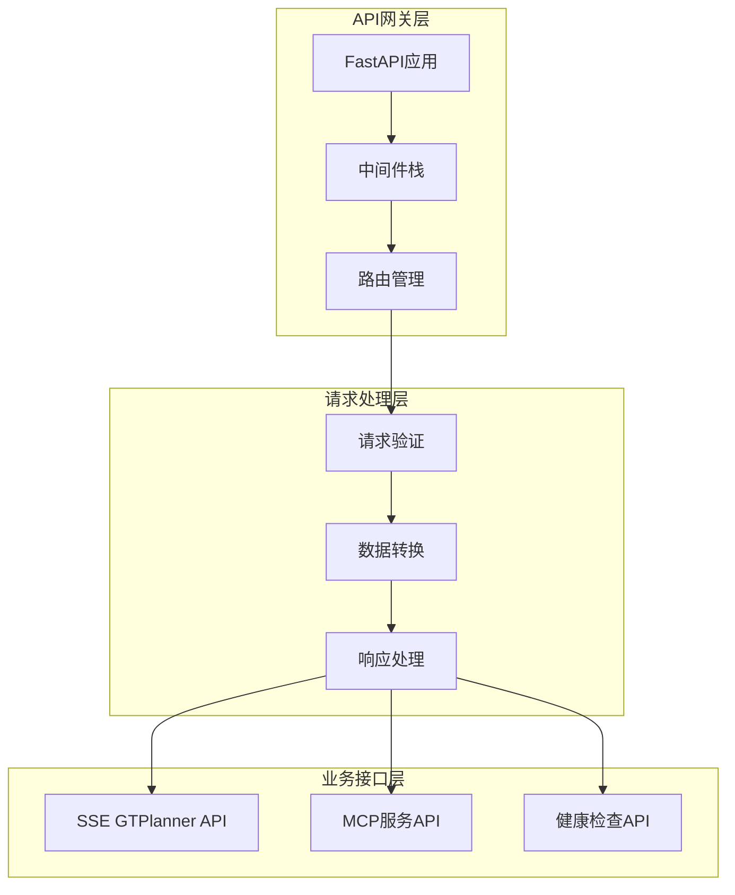

### 2. SSE流式响应架构

```python
class SSEGTPlanner:
    """基于新流式响应架构的GTPlanner SSE API"""
    
    async def process_request_stream(
        self,
        agent_context: Dict[str, Any],
        response_writer: Callable[[str], Awaitable[None]],
        language: Optional[str] = None,
        **config_options
    ) -> Dict[str, Any]:
        """处理用户请求并通过SSE流式返回结果"""
        pass
```

#### SSE事件流设计

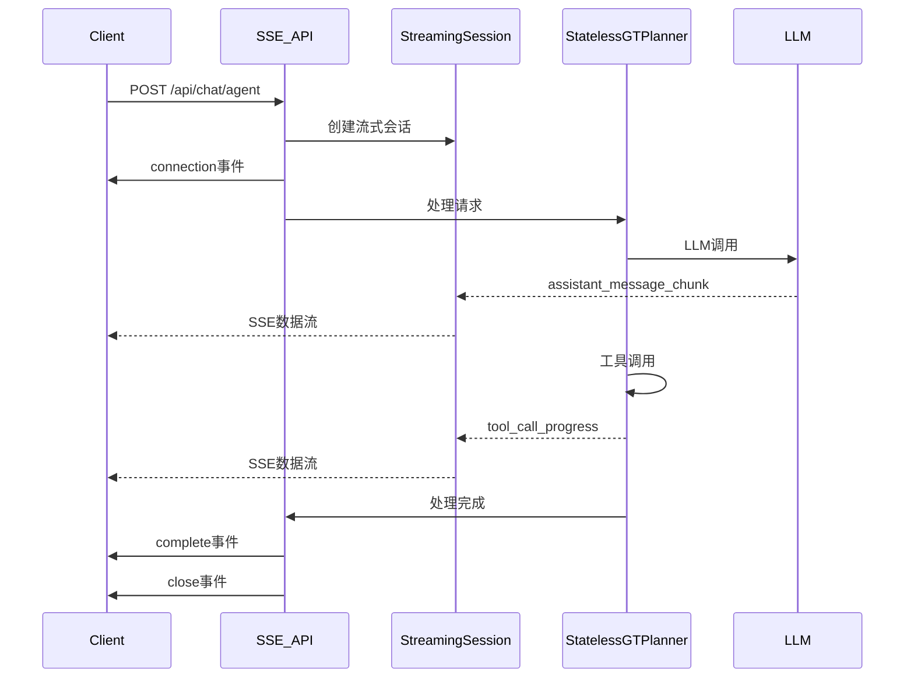

### 3. MCP服务集成

```python
# MCP服务架构
@app.tool(description="Generate workflow based on user requirements")
async def generate_flow(
    requirement: str,
    previous_flow: Optional[str] = None,
    language: Optional[str] = None,
    user_id: Optional[str] = None,
) -> dict:
    """Generate workflow with multilingual support"""
    pass

@app.tool(description="Generate detailed design document")
async def generate_design_doc(
    requirement: str,
    previous_flow: str,
    design_doc: Optional[Any] = None,
    language: Optional[str] = None,
    user_id: Optional[str] = None,
) -> dict:
    """Generate detailed design document with multilingual support"""
    pass
```

---

## 🌊 数据流架构

### 1. 无状态数据流设计

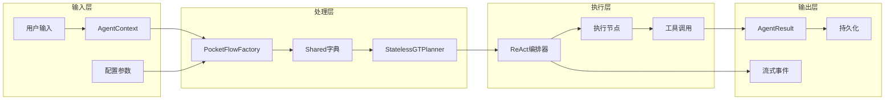

### 2. 上下文数据结构

```python
@dataclass
class AgentContext:
    """无状态Agent上下文"""
    session_id: str
    dialogue_history: List[Message]
    tool_execution_results: Dict[str, Any]
    session_metadata: Dict[str, Any]
    last_updated: Optional[str] = None
    is_compressed: bool = False
    
    @classmethod
    def from_dict(cls, data: Dict[str, Any]) -> 'AgentContext':
        """从字典创建AgentContext实例"""
        pass
    
    def to_dict(self) -> Dict[str, Any]:
        """转换为字典格式"""
        pass
```

### 3. 消息流转架构

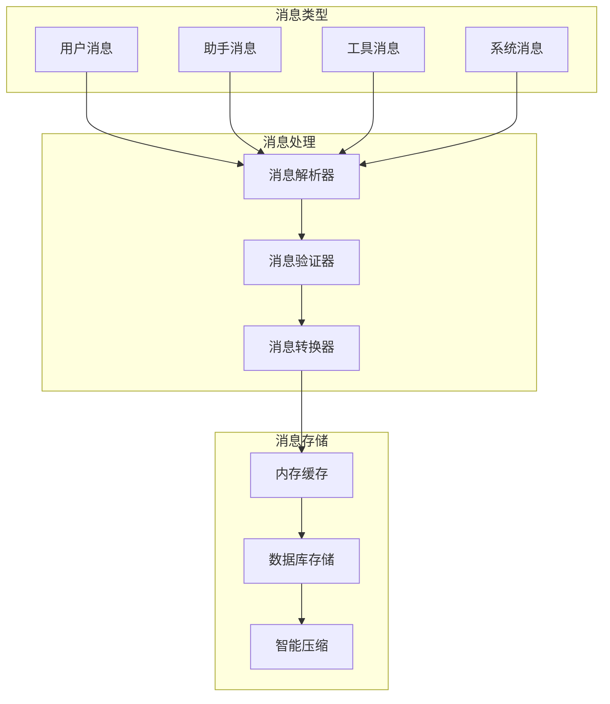

---

## ⚙️ 配置管理架构

### 1. 分层配置设计

```toml
# settings.toml - 主配置文件
[default]
debug = true

[default.logging]
level = "INFO"
file_enabled = true
console_enabled = false

[default.llm]
base_url = "@format {env[LLM_BASE_URL]}"
api_key = "@format {env[LLM_API_KEY]}"
model = "@format {env[LLM_MODEL]}"

[default.multilingual]
default_language = "en"
auto_detect = true
fallback_enabled = true
supported_languages = ["en", "zh", "es", "fr", "ja"]

[default.vector_service]
base_url = "http://localhost:8080"
timeout = 30
tools_index_name = "document_gtplanner_tools"
vector_field = "combined_text"
```

### 2. 配置管理架构

```python
class MultilingualConfig:
    """多语言配置管理器"""
    
    def __init__(self, settings_file: str = "settings.toml"):
        self._settings = Dynaconf(
            settings_files=[settings_file],
            environments=True,
            load_dotenv=True,
            envvar_prefix="GTPLANNER"
        )
    
    def get_llm_config(self) -> Dict[str, Any]:
        """获取LLM配置"""
        pass
    
    def get_vector_service_config(self) -> Dict[str, Any]:
        """获取向量服务配置"""
        pass
```

### 3. 环境变量管理

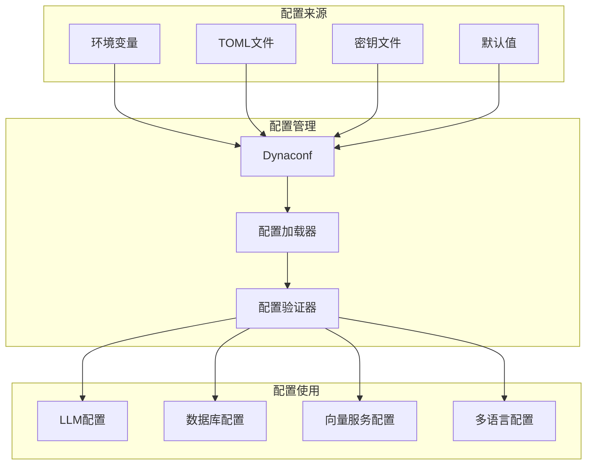

---

## 🚀 部署架构

### 1. 容器化部署

```dockerfile
# Dockerfile
FROM python:3.11-slim

WORKDIR /app
COPY requirements.txt .
RUN pip install -r requirements.txt

COPY . .
EXPOSE 11211 8001

CMD ["python", "fastapi_main.py"]
```

### 2. 服务拓扑

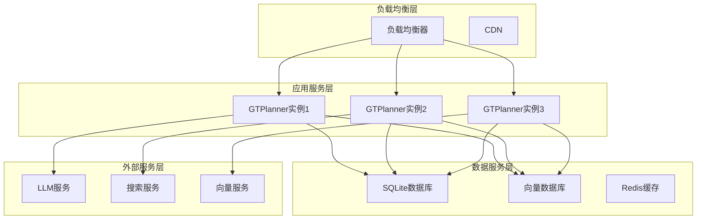

---

## 🔒 请求验证系统架构设计

### 📐 设计模式应用

**1. 策略模式（Strategy Pattern）** - 验证策略
**2. 责任链模式（Chain of Responsibility）** - 验证链  
**3. 工厂模式（Factory Pattern）** - 验证器创建
**4. 装饰器模式（Decorator Pattern）** - 中间件装饰
**5. 观察者模式（Observer Pattern）** - 验证事件通知
**6. 模板方法模式（Template Method Pattern）** - 验证器基类模板
**7. 建造者模式（Builder Pattern）** - 复杂验证规则构建
**8. 适配器模式（Adapter Pattern）** - 不同验证框架适配

### 📁 目录结构

```
GTPlanner/
├── agent/
│   └── validation/
│       ├── __init__.py
│       ├── core/
│       │   ├── __init__.py
│       │   ├── interfaces.py          # 抽象接口定义
│       │   ├── base_validator.py      # 基础验证器模板
│       │   ├── validation_context.py  # 验证上下文
│       │   ├── validation_result.py   # 验证结果
│       │   ├── validation_error.py    # 验证错误定义
│       │   └── validation_registry.py # 验证器注册表
│       ├── strategies/
│       │   ├── __init__.py
│       │   ├── size_validator.py      # 大小验证策略
│       │   ├── format_validator.py    # 格式验证策略
│       │   ├── content_validator.py   # 内容验证策略
│       │   ├── security_validator.py  # 安全验证策略
│       │   ├── rate_limit_validator.py # 频率限制策略
│       │   ├── language_validator.py  # 多语言验证策略
│       │   └── session_validator.py   # 会话验证策略
│       ├── chains/
│       │   ├── __init__.py
│       │   ├── validation_chain.py    # 验证责任链
│       │   ├── chain_builder.py       # 链构建器
│       │   └── async_validation_chain.py # 异步验证链
│       ├── factories/
│       │   ├── __init__.py
│       │   ├── validator_factory.py   # 验证器工厂
│       │   ├── chain_factory.py       # 链工厂
│       │   └── config_factory.py      # 配置工厂
│       ├── middleware/
│       │   ├── __init__.py
│       │   ├── validation_middleware.py # 验证中间件
│       │   ├── error_middleware.py     # 错误处理中间件
│       │   └── cors_validation_middleware.py # CORS验证中间件
│       ├── observers/
│       │   ├── __init__.py
│       │   ├── validation_observer.py  # 验证观察者
│       │   ├── metrics_observer.py     # 指标收集观察者
│       │   ├── logging_observer.py     # 日志观察者
│       │   └── streaming_observer.py   # 流式响应观察者
│       ├── adapters/
│       │   ├── __init__.py
│       │   ├── pydantic_adapter.py     # Pydantic验证适配器
│       │   ├── fastapi_adapter.py      # FastAPI验证适配器
│       │   └── sse_adapter.py          # SSE流式验证适配器
│       ├── config/
│       │   ├── __init__.py
│       │   ├── validation_config.py    # 验证配置管理器
│       │   ├── rules.py               # 验证规则定义
│       │   └── endpoint_config.py      # 端点验证配置
│       └── utils/
│           ├── __init__.py
│           ├── validation_utils.py     # 验证工具函数
│           ├── error_formatters.py     # 错误格式化工具
│           └── cache_manager.py        # 验证缓存管理
```

## 🎯 核心架构设计

### 1. 接口定义（Interface Segregation Principle）

```python
# agent/validation/core/interfaces.py
from abc import ABC, abstractmethod
from typing import Any, Dict, List, Optional, AsyncIterator
from enum import Enum
from .validation_context import ValidationContext
from .validation_result import ValidationResult
from .validation_error import ValidationError

class ValidatorPriority(Enum):
    """验证器优先级"""
    CRITICAL = 1    # 关键验证（安全、认证）
    HIGH = 2        # 高优先级（格式、大小）
    MEDIUM = 3      # 中优先级（内容、语言）
    LOW = 4         # 低优先级（性能优化）

class IValidator(ABC):
    """验证器接口"""
    
    @abstractmethod
    async def validate(self, context: ValidationContext) -> ValidationResult:
        """执行验证"""
        pass
    
    @abstractmethod
    def get_validator_name(self) -> str:
        """获取验证器名称"""
        pass
    
    @abstractmethod
    def get_priority(self) -> ValidatorPriority:
        """获取验证器优先级"""
        pass
    
    @abstractmethod
    def supports_async(self) -> bool:
        """是否支持异步验证"""
        pass

class IValidationStrategy(ABC):
    """验证策略接口"""
    
    @abstractmethod
    async def execute(self, data: Any, rules: Dict[str, Any]) -> ValidationResult:
        """执行验证策略"""
        pass
    
    @abstractmethod
    def get_strategy_name(self) -> str:
        """获取策略名称"""
        pass

class IValidationChain(ABC):
    """验证链接口"""
    
    @abstractmethod
    def add_validator(self, validator: IValidator) -> 'IValidationChain':
        """添加验证器"""
        pass
    
    @abstractmethod
    def remove_validator(self, validator_name: str) -> 'IValidationChain':
        """移除验证器"""
        pass
    
    @abstractmethod
    async def validate(self, context: ValidationContext) -> ValidationResult:
        """执行验证链"""
        pass
    
    @abstractmethod
    async def validate_parallel(self, context: ValidationContext) -> ValidationResult:
        """并行执行验证链"""
        pass

class IValidationObserver(ABC):
    """验证观察者接口"""
    
    @abstractmethod
    async def on_validation_start(self, context: ValidationContext) -> None:
        """验证开始事件"""
        pass
    
    @abstractmethod
    async def on_validation_step(self, validator_name: str, result: ValidationResult) -> None:
        """验证步骤完成事件"""
        pass
    
    @abstractmethod
    async def on_validation_complete(self, result: ValidationResult) -> None:
        """验证完成事件"""
        pass
    
    @abstractmethod
    async def on_validation_error(self, error: Exception, context: Optional[ValidationContext] = None) -> None:
        """验证错误事件"""
        pass

class IValidationMiddleware(ABC):
    """验证中间件接口"""
    
    @abstractmethod
    async def process_request(self, request: Any, call_next: Any) -> Any:
        """处理请求"""
        pass
    
    @abstractmethod
    def get_middleware_name(self) -> str:
        """获取中间件名称"""
        pass

class IValidationCache(ABC):
    """验证缓存接口"""
    
    @abstractmethod
    async def get(self, key: str) -> Optional[ValidationResult]:
        """获取缓存结果"""
        pass
    
    @abstractmethod
    async def set(self, key: str, result: ValidationResult, ttl: int = 300) -> None:
        """设置缓存结果"""
        pass
    
    @abstractmethod
    async def invalidate(self, pattern: str) -> None:
        """失效缓存"""
        pass

class IValidationMetrics(ABC):
    """验证指标接口"""
    
    @abstractmethod
    def record_validation_time(self, validator_name: str, duration: float) -> None:
        """记录验证时间"""
        pass
    
    @abstractmethod
    def record_validation_result(self, validator_name: str, success: bool) -> None:
        """记录验证结果"""
        pass
    
    @abstractmethod
    def get_metrics(self) -> Dict[str, Any]:
        """获取指标数据"""
        pass
```

### 2. 验证上下文（Context Pattern）

```python
# agent/validation/core/validation_context.py
from dataclasses import dataclass, field
from typing import Any, Dict, Optional, List, Union
from datetime import datetime
from fastapi import Request
from enum import Enum

class ValidationMode(Enum):
    """验证模式"""
    STRICT = "strict"        # 严格模式：所有验证器必须通过
    LENIENT = "lenient"      # 宽松模式：允许警告
    FAIL_FAST = "fail_fast"  # 快速失败：遇到错误立即停止
    CONTINUE = "continue"    # 继续模式：收集所有错误后返回

@dataclass
class ValidationContext:
    """验证上下文 - 包含完整的验证环境信息"""
    
    # 请求相关信息
    request: Optional[Request] = None
    request_data: Any = None
    request_headers: Dict[str, str] = field(default_factory=dict)
    request_method: str = "POST"
    request_path: str = ""
    request_size: int = 0
    
    # 验证配置
    validation_rules: Dict[str, Any] = field(default_factory=dict)
    validation_mode: ValidationMode = ValidationMode.STRICT
    skip_validators: List[str] = field(default_factory=list)
    enabled_validators: List[str] = field(default_factory=list)
    
    # 会话和用户信息
    request_id: str = field(default_factory=lambda: f"req_{datetime.now().timestamp()}")
    user_id: Optional[str] = None
    session_id: Optional[str] = None
    client_ip: Optional[str] = None
    user_agent: Optional[str] = None
    
    # 多语言支持
    language: Optional[str] = None
    detected_language: Optional[str] = None
    supported_languages: List[str] = field(default_factory=lambda: ["en", "zh", "es", "fr", "ja"])
    
    # 验证状态追踪
    current_validator: Optional[str] = None
    validation_path: List[str] = field(default_factory=list)
    validation_start_time: Optional[datetime] = None
    validation_metadata: Dict[str, Any] = field(default_factory=dict)
    
    # 缓存和性能
    cache_key: Optional[str] = None
    enable_cache: bool = True
    cache_ttl: int = 300  # 5分钟
    
    # 流式响应支持
    streaming_session: Optional[Any] = None  # StreamingSession
    enable_streaming_validation: bool = False
    
    def __post_init__(self):
        """初始化后处理"""
        if self.validation_start_time is None:
            self.validation_start_time = datetime.now()
        
        # 从request中提取信息
        if self.request:
            self._extract_request_info()
        
        # 生成缓存键
        if self.enable_cache and not self.cache_key:
            self._generate_cache_key()
    
    def _extract_request_info(self) -> None:
        """从FastAPI Request对象中提取信息"""
        if not self.request:
            return
            
        self.request_headers = dict(self.request.headers)
        self.request_method = self.request.method
        self.request_path = str(self.request.url.path)
        self.client_ip = self.request.client.host if self.request.client else None
        self.user_agent = self.request_headers.get("user-agent")
        
        # 提取Content-Length
        content_length = self.request_headers.get("content-length")
        if content_length:
            try:
                self.request_size = int(content_length)
            except ValueError:
                self.request_size = 0
    
    def _generate_cache_key(self) -> None:
        """生成验证缓存键"""
        key_parts = [
            self.request_method,
            self.request_path,
            str(self.request_size),
            self.user_id or "anonymous",
            str(hash(str(self.validation_rules)))
        ]
        self.cache_key = "|".join(key_parts)
    
    def should_skip_validator(self, validator_name: str) -> bool:
        """检查是否应跳过指定验证器"""
        if validator_name in self.skip_validators:
            return True
        
        # 如果指定了enabled_validators，只运行列表中的验证器
        if self.enabled_validators and validator_name not in self.enabled_validators:
            return True
            
        return False
    
    def add_to_path(self, validator_name: str) -> None:
        """添加到验证路径"""
        self.validation_path.append(validator_name)
        self.current_validator = validator_name
    
    def get_execution_time(self) -> float:
        """获取验证执行时间（秒）"""
        if self.validation_start_time:
            return (datetime.now() - self.validation_start_time).total_seconds()
        return 0.0
    
    def is_api_endpoint(self) -> bool:
        """判断是否为API端点"""
        return self.request_path.startswith("/api/")
    
    def is_streaming_request(self) -> bool:
        """判断是否为流式请求"""
        return (
            self.enable_streaming_validation and 
            self.streaming_session is not None
        )
    
    def get_language_preference(self) -> str:
        """获取语言偏好"""
        # 优先级：显式指定 > 检测到的语言 > 默认语言
        return (
            self.language or 
            self.detected_language or 
            (self.supported_languages[0] if self.supported_languages else "en")
        )
    
    def to_dict(self) -> Dict[str, Any]:
        """转换为字典格式（用于日志和调试）"""
        return {
            "request_id": self.request_id,
            "request_method": self.request_method,
            "request_path": self.request_path,
            "request_size": self.request_size,
            "session_id": self.session_id,
            "user_id": self.user_id,
            "language": self.get_language_preference(),
            "validation_mode": self.validation_mode.value,
            "validation_path": self.validation_path,
            "execution_time": self.get_execution_time(),
            "cache_enabled": self.enable_cache,
            "streaming_enabled": self.enable_streaming_validation
        }
```

### 3. 验证结果（Value Object Pattern）

```python
# agent/validation/core/validation_result.py
from dataclasses import dataclass, field
from typing import List, Dict, Any, Optional, Union
from datetime import datetime
from enum import Enum

class ValidationStatus(Enum):
    """验证状态"""
    SUCCESS = "success"
    WARNING = "warning"
    ERROR = "error"
    CRITICAL = "critical"
    SKIPPED = "skipped"

class ValidationSeverity(Enum):
    """验证严重程度"""
    LOW = 1
    MEDIUM = 2
    HIGH = 3
    CRITICAL = 4

@dataclass
class ValidationError:
    """验证错误详细信息"""
    code: str
    message: str
    field: Optional[str] = None
    value: Optional[Any] = None
    validator: Optional[str] = None
    severity: ValidationSeverity = ValidationSeverity.MEDIUM
    suggestion: Optional[str] = None
    timestamp: datetime = field(default_factory=datetime.now)
    
    def to_dict(self) -> Dict[str, Any]:
        """转换为字典格式"""
        return {
            "code": self.code,
            "message": self.message,
            "field": self.field,
            "value": str(self.value) if self.value is not None else None,
            "validator": self.validator,
            "severity": self.severity.name,
            "suggestion": self.suggestion,
            "timestamp": self.timestamp.isoformat()
        }

@dataclass
class ValidationMetrics:
    """验证指标"""
    total_validators: int = 0
    executed_validators: int = 0
    skipped_validators: int = 0
    execution_time: float = 0.0
    cache_hits: int = 0
    cache_misses: int = 0
    
    def to_dict(self) -> Dict[str, Any]:
        """转换为字典格式"""
        return {
            "total_validators": self.total_validators,
            "executed_validators": self.executed_validators,
            "skipped_validators": self.skipped_validators,
            "execution_time": self.execution_time,
            "cache_hits": self.cache_hits,
            "cache_misses": self.cache_misses,
            "success_rate": self.get_success_rate()
        }
    
    def get_success_rate(self) -> float:
        """计算成功率"""
        if self.executed_validators == 0:
            return 0.0
        return (self.executed_validators - self.skipped_validators) / self.executed_validators

@dataclass
class ValidationResult:
    """验证结果 - 包含完整的验证信息"""
    
    status: ValidationStatus
    errors: List[ValidationError] = field(default_factory=list)
    warnings: List[ValidationError] = field(default_factory=list)
    metadata: Dict[str, Any] = field(default_factory=dict)
    metrics: ValidationMetrics = field(default_factory=ValidationMetrics)
    
    # 验证上下文信息
    request_id: Optional[str] = None
    validator_results: Dict[str, ValidationStatus] = field(default_factory=dict)
    execution_order: List[str] = field(default_factory=list)
    
    # 时间戳
    start_time: datetime = field(default_factory=datetime.now)
    end_time: Optional[datetime] = None
    
    @property
    def is_valid(self) -> bool:
        """是否验证通过（成功或仅有警告）"""
        return self.status in [ValidationStatus.SUCCESS, ValidationStatus.WARNING]
    
    @property
    def has_errors(self) -> bool:
        """是否有错误"""
        return len(self.errors) > 0
    
    @property
    def has_warnings(self) -> bool:
        """是否有警告"""
        return len(self.warnings) > 0
    
    @property
    def has_critical_errors(self) -> bool:
        """是否有严重错误"""
        return any(error.severity == ValidationSeverity.CRITICAL for error in self.errors)
    
    @property
    def execution_time(self) -> float:
        """获取执行时间（秒）"""
        if self.end_time and self.start_time:
            return (self.end_time - self.start_time).total_seconds()
        return 0.0
    
    def add_error(self, error: ValidationError) -> None:
        """添加错误"""
        self.errors.append(error)
        self._update_status_from_error(error)
    
    def add_warning(self, warning: ValidationError) -> None:
        """添加警告"""
        self.warnings.append(warning)
        if self.status == ValidationStatus.SUCCESS:
            self.status = ValidationStatus.WARNING
    
    def add_validator_result(self, validator_name: str, status: ValidationStatus) -> None:
        """记录验证器执行结果"""
        self.validator_results[validator_name] = status
        self.execution_order.append(validator_name)
        self.metrics.executed_validators += 1
    
    def _update_status_from_error(self, error: ValidationError) -> None:
        """根据错误更新状态"""
        if error.severity == ValidationSeverity.CRITICAL:
            self.status = ValidationStatus.CRITICAL
        elif self.status in [ValidationStatus.SUCCESS, ValidationStatus.WARNING]:
            self.status = ValidationStatus.ERROR
    
    def complete(self) -> None:
        """标记验证完成"""
        self.end_time = datetime.now()
        self.metrics.execution_time = self.execution_time
    
    def merge(self, other: 'ValidationResult') -> 'ValidationResult':
        """合并验证结果"""
        # 确定合并后的状态
        status_priority = {
            ValidationStatus.CRITICAL: 4,
            ValidationStatus.ERROR: 3,
            ValidationStatus.WARNING: 2,
            ValidationStatus.SUCCESS: 1,
            ValidationStatus.SKIPPED: 0
        }
        
        merged_status = max(
            self.status, other.status, 
            key=lambda x: status_priority[x]
        )
        
        # 合并指标
        merged_metrics = ValidationMetrics(
            total_validators=self.metrics.total_validators + other.metrics.total_validators,
            executed_validators=self.metrics.executed_validators + other.metrics.executed_validators,
            skipped_validators=self.metrics.skipped_validators + other.metrics.skipped_validators,
            execution_time=self.metrics.execution_time + other.metrics.execution_time,
            cache_hits=self.metrics.cache_hits + other.metrics.cache_hits,
            cache_misses=self.metrics.cache_misses + other.metrics.cache_misses
        )
        
        merged = ValidationResult(
            status=merged_status,
            errors=self.errors + other.errors,
            warnings=self.warnings + other.warnings,
            metadata={**self.metadata, **other.metadata},
            metrics=merged_metrics,
            request_id=self.request_id or other.request_id,
            validator_results={**self.validator_results, **other.validator_results},
            execution_order=self.execution_order + other.execution_order,
            start_time=min(self.start_time, other.start_time)
        )
        
        return merged
    
    def get_errors_by_severity(self, severity: ValidationSeverity) -> List[ValidationError]:
        """按严重程度获取错误"""
        return [error for error in self.errors if error.severity == severity]
    
    def get_failed_validators(self) -> List[str]:
        """获取失败的验证器列表"""
        return [
            name for name, status in self.validator_results.items()
            if status in [ValidationStatus.ERROR, ValidationStatus.CRITICAL]
        ]
    
    def to_dict(self) -> Dict[str, Any]:
        """转换为字典格式"""
        return {
            "status": self.status.value,
            "is_valid": self.is_valid,
            "errors": [error.to_dict() for error in self.errors],
            "warnings": [warning.to_dict() for warning in self.warnings],
            "metadata": self.metadata,
            "metrics": self.metrics.to_dict(),
            "request_id": self.request_id,
            "validator_results": {k: v.value for k, v in self.validator_results.items()},
            "execution_order": self.execution_order,
            "execution_time": self.execution_time,
            "has_critical_errors": self.has_critical_errors
        }
    
    def to_http_response(self) -> Dict[str, Any]:
        """转换为HTTP响应格式"""
        if self.is_valid:
            return {
                "success": True,
                "status": self.status.value,
                "warnings": [warning.to_dict() for warning in self.warnings] if self.warnings else None,
                "metadata": self.metadata if self.metadata else None
            }
        else:
            return {
                "success": False,
                "status": self.status.value,
                "errors": [error.to_dict() for error in self.errors],
                "warnings": [warning.to_dict() for warning in self.warnings] if self.warnings else None,
                "failed_validators": self.get_failed_validators(),
                "request_id": self.request_id
            }
    
    @classmethod
    def create_success(cls, metadata: Optional[Dict[str, Any]] = None) -> 'ValidationResult':
        """创建成功结果"""
        return cls(
            status=ValidationStatus.SUCCESS,
            metadata=metadata or {}
        )
    
    @classmethod
    def create_error(cls, error: ValidationError, metadata: Optional[Dict[str, Any]] = None) -> 'ValidationResult':
        """创建错误结果"""
        result = cls(
            status=ValidationStatus.ERROR,
            metadata=metadata or {}
        )
        result.add_error(error)
        return result
```

## 📋 配置文件更新

```toml
# settings.toml 新增部分
[default.validation]
# 请求验证全局配置
enabled = true
mode = "strict"  # strict, lenient, fail_fast, continue
max_request_size = 1048576  # 1MB
max_message_length = 10000
enable_rate_limiting = true
requests_per_minute = 60
enable_caching = true
cache_ttl = 300  # 5分钟
enable_metrics = true
enable_streaming_validation = false

# 验证器优先级配置
[default.validation.priorities]
security = "critical"
format = "high"
content = "medium"
rate_limit = "high"
size = "high"
language = "low"
session = "medium"

# API端点验证链配置
[default.validation.endpoints]
# 主要API端点
"/api/chat/agent" = ["security", "rate_limit", "size", "format", "content", "language", "session"]
"/health" = ["size"]
"/api/status" = ["security", "size"]
"/api/mcp/*" = ["security", "rate_limit", "format", "content"]

# 验证器具体配置
[[default.validation.validators]]
name = "security"
type = "security"
enabled = true
priority = "critical"
[default.validation.validators.config]
enable_xss_protection = true
enable_sql_injection_detection = true
enable_csrf_protection = true
allowed_origins = ["*"]
max_header_size = 8192

[[default.validation.validators]]
name = "rate_limit"
type = "rate_limit"
enabled = true
priority = "high"
[default.validation.validators.config]
requests_per_minute = 60
requests_per_hour = 1000
enable_ip_based_limiting = true
enable_user_based_limiting = true
burst_size = 10

[[default.validation.validators]]
name = "size"
type = "size"
enabled = true
priority = "high"
[default.validation.validators.config]
max_request_size = 1048576
max_content_length = 1048576
max_json_depth = 10
max_array_length = 1000

[[default.validation.validators]]
name = "format"
type = "format"
enabled = true
priority = "high"
[default.validation.validators.config]
require_json_content_type = true
validate_json_syntax = true
validate_required_fields = true
strict_field_types = true

[[default.validation.validators]]
name = "content"
type = "content"
enabled = true
priority = "medium"
[default.validation.validators.config]
max_message_length = 10000
enable_profanity_filter = false
enable_spam_detection = true
max_dialogue_history_length = 50

[[default.validation.validators]]
name = "language"
type = "language"
enabled = true
priority = "low"
[default.validation.validators.config]
supported_languages = ["en", "zh", "es", "fr", "ja"]
auto_detect_language = true
fallback_to_default = true
validate_language_consistency = false

[[default.validation.validators]]
name = "session"
type = "session"
enabled = true
priority = "medium"
[default.validation.validators.config]
validate_session_id_format = true
check_session_expiry = false
require_valid_session = false
max_session_inactivity = 3600  # 1小时

# 缓存配置
[default.validation.cache]
enabled = true
backend = "memory"  # memory, redis
default_ttl = 300
max_size = 1000
cleanup_interval = 60

# 指标和监控配置
[default.validation.metrics]
enabled = true
include_timing = true
include_success_rate = true
include_error_details = true
export_interval = 60

# 日志配置
[default.validation.logging]
enabled = true
level = "INFO"
include_request_details = true
include_validation_path = true
include_performance_metrics = true
log_successful_validations = false
log_failed_validations = true

# 错误处理配置
[default.validation.error_handling]
include_suggestions = true
include_error_codes = true
include_field_details = true
mask_sensitive_data = true
max_error_message_length = 500

# 流式验证配置
[default.validation.streaming]
enabled = false
validate_chunks = true
buffer_size = 1024
timeout = 30
```

---

## 🏗️ 核心组件详细设计

### 1. 验证策略实现（Strategy Pattern）

```python
# agent/validation/strategies/security_validator.py
from typing import Dict, Any, List, Optional, Pattern
import re
from ..core.interfaces import IValidationStrategy
from ..core.validation_result import ValidationResult, ValidationError, ValidationSeverity

class SecurityValidationStrategy(IValidationStrategy):
    """安全验证策略 - 检测XSS、SQL注入等安全威胁"""
    
    def __init__(self, config: Dict[str, Any]):
        self.config = config
        self.xss_patterns = self._compile_xss_patterns()
        self.sql_injection_patterns = self._compile_sql_patterns()
        self.sensitive_patterns = self._compile_sensitive_patterns()
    
    def _compile_xss_patterns(self) -> List[Pattern]:
        """编译XSS检测模式"""
        patterns = [
            r'<script[^>]*>.*?</script>',
            r'javascript:',
            r'on\w+\s*=',
            r'<iframe[^>]*>',
            r'<object[^>]*>',
            r'<embed[^>]*>'
        ]
        return [re.compile(pattern, re.IGNORECASE) for pattern in patterns]
    
    def _compile_sql_patterns(self) -> List[Pattern]:
        """编译SQL注入检测模式"""
        patterns = [
            r'\b(union|select|insert|update|delete|drop|create|alter)\b.*\b(from|where|into)\b',
            r'[\'\"]\s*(or|and)\s*[\'\"]\s*=\s*[\'\"]\s*[\'\"]\s*',
            r';\s*(drop|delete|update|insert)',
            r'--\s*',
            r'/\*.*?\*/'
        ]
        return [re.compile(pattern, re.IGNORECASE) for pattern in patterns]
    
    def _compile_sensitive_patterns(self) -> List[Pattern]:
        """编译敏感信息检测模式"""
        patterns = [
            r'\b[A-Za-z0-9._%+-]+@[A-Za-z0-9.-]+\.[A-Z|a-z]{2,}\b',  # Email
            r'\b\d{4}[- ]?\d{4}[- ]?\d{4}[- ]?\d{4}\b',  # 信用卡号
            r'\b\d{3}-\d{2}-\d{4}\b',  # SSN
            r'\b(?:\d{1,3}\.){3}\d{1,3}\b',  # IP地址
        ]
        return [re.compile(pattern) for pattern in patterns]
    
    async def execute(self, data: Any, rules: Dict[str, Any]) -> ValidationResult:
        """执行安全验证"""
        result = ValidationResult.create_success()
        
        if isinstance(data, str):
            content = data
        elif isinstance(data, dict):
            content = str(data)
        else:
            content = str(data)
        
        # XSS检测
        if self.config.get("enable_xss_protection", True):
            await self._check_xss(content, result)
        
        # SQL注入检测
        if self.config.get("enable_sql_injection_detection", True):
            await self._check_sql_injection(content, result)
        
        # 敏感信息检测
        if self.config.get("enable_sensitive_data_detection", False):
            await self._check_sensitive_data(content, result)
        
        return result
    
    async def _check_xss(self, content: str, result: ValidationResult) -> None:
        """检查XSS攻击"""
        for pattern in self.xss_patterns:
            if pattern.search(content):
                error = ValidationError(
                    code="XSS_DETECTED",
                    message="检测到潜在的XSS攻击代码",
                    validator="security",
                    severity=ValidationSeverity.CRITICAL,
                    suggestion="请移除HTML标签和JavaScript代码"
                )
                result.add_error(error)
                break
    
    async def _check_sql_injection(self, content: str, result: ValidationResult) -> None:
        """检查SQL注入"""
        for pattern in self.sql_injection_patterns:
            if pattern.search(content):
                error = ValidationError(
                    code="SQL_INJECTION_DETECTED",
                    message="检测到潜在的SQL注入攻击",
                    validator="security",
                    severity=ValidationSeverity.CRITICAL,
                    suggestion="请避免使用SQL关键字和特殊字符"
                )
                result.add_error(error)
                break
    
    async def _check_sensitive_data(self, content: str, result: ValidationResult) -> None:
        """检查敏感信息"""
        for pattern in self.sensitive_patterns:
            if pattern.search(content):
                error = ValidationError(
                    code="SENSITIVE_DATA_DETECTED",
                    message="检测到可能的敏感信息",
                    validator="security",
                    severity=ValidationSeverity.HIGH,
                    suggestion="请避免在请求中包含敏感个人信息"
                )
                result.add_warning(error)
                break
    
    def get_strategy_name(self) -> str:
        return "security"
```

### 2. 验证链实现（Chain of Responsibility Pattern）

```python
# agent/validation/chains/async_validation_chain.py
import asyncio
from typing import List, Dict, Any, Optional
from ..core.interfaces import IValidator, IValidationChain
from ..core.validation_context import ValidationContext, ValidationMode
from ..core.validation_result import ValidationResult, ValidationStatus
from ..utils.validation_utils import ValidationTimer

class AsyncValidationChain(IValidationChain):
    """异步验证链 - 支持并行和串行执行"""
    
    def __init__(self, name: str = "default"):
        self.name = name
        self.validators: List[IValidator] = []
        self.parallel_groups: Dict[str, List[IValidator]] = {}
        
    def add_validator(self, validator: IValidator) -> 'AsyncValidationChain':
        """添加验证器到链中"""
        if validator not in self.validators:
            self.validators.append(validator)
            # 按优先级排序
            self.validators.sort(key=lambda v: v.get_priority().value)
        return self
    
    def remove_validator(self, validator_name: str) -> 'AsyncValidationChain':
        """从链中移除验证器"""
        self.validators = [v for v in self.validators if v.get_validator_name() != validator_name]
        return self
    
    def add_parallel_group(self, group_name: str, validators: List[IValidator]) -> 'AsyncValidationChain':
        """添加并行执行组"""
        self.parallel_groups[group_name] = validators
        return self
    
    async def validate(self, context: ValidationContext) -> ValidationResult:
        """串行执行验证链"""
        result = ValidationResult.create_success()
        result.request_id = context.request_id
        
        with ValidationTimer() as timer:
            for validator in self.validators:
                if context.should_skip_validator(validator.get_validator_name()):
                    result.add_validator_result(validator.get_validator_name(), ValidationStatus.SKIPPED)
                    result.metrics.skipped_validators += 1
                    continue
                
                context.add_to_path(validator.get_validator_name())
                
                try:
                    validator_result = await validator.validate(context)
                    result = result.merge(validator_result)
                    result.add_validator_result(validator.get_validator_name(), validator_result.status)
                    
                    # 快速失败模式
                    if (context.validation_mode == ValidationMode.FAIL_FAST and 
                        not validator_result.is_valid):
                        break
                        
                except Exception as e:
                    error = ValidationError(
                        code="VALIDATOR_ERROR",
                        message=f"验证器 {validator.get_validator_name()} 执行失败: {str(e)}",
                        validator=validator.get_validator_name(),
                        severity=ValidationSeverity.HIGH
                    )
                    result.add_error(error)
                    result.add_validator_result(validator.get_validator_name(), ValidationStatus.ERROR)
        
        result.metrics.execution_time = timer.elapsed_time
        result.complete()
        return result
    
    async def validate_parallel(self, context: ValidationContext) -> ValidationResult:
        """并行执行验证链"""
        result = ValidationResult.create_success()
        result.request_id = context.request_id
        
        with ValidationTimer() as timer:
            # 创建验证任务
            tasks = []
            for validator in self.validators:
                if context.should_skip_validator(validator.get_validator_name()):
                    result.add_validator_result(validator.get_validator_name(), ValidationStatus.SKIPPED)
                    result.metrics.skipped_validators += 1
                    continue
                
                task = self._create_validation_task(validator, context)
                tasks.append(task)
            
            # 并行执行
            if tasks:
                validator_results = await asyncio.gather(*tasks, return_exceptions=True)
                
                for i, validator_result in enumerate(validator_results):
                    validator = self.validators[i]
                    validator_name = validator.get_validator_name()
                    
                    if isinstance(validator_result, Exception):
                        error = ValidationError(
                            code="VALIDATOR_ERROR",
                            message=f"验证器 {validator_name} 执行失败: {str(validator_result)}",
                            validator=validator_name,
                            severity=ValidationSeverity.HIGH
                        )
                        result.add_error(error)
                        result.add_validator_result(validator_name, ValidationStatus.ERROR)
                    else:
                        result = result.merge(validator_result)
                        result.add_validator_result(validator_name, validator_result.status)
        
        result.metrics.execution_time = timer.elapsed_time
        result.complete()
        return result
    
    async def _create_validation_task(self, validator: IValidator, context: ValidationContext):
        """创建验证任务"""
        try:
            return await validator.validate(context)
        except Exception as e:
            return ValidationResult.create_error(
                ValidationError(
                    code="VALIDATOR_EXCEPTION",
                    message=str(e),
                    validator=validator.get_validator_name(),
                    severity=ValidationSeverity.HIGH
                )
            )
```

### 3. 中间件集成（Middleware Pattern）

```python
# agent/validation/middleware/validation_middleware.py
import time
from typing import Dict, Any, Optional, Callable
from fastapi import Request, Response, HTTPException
from starlette.middleware.base import BaseHTTPMiddleware
from starlette.responses import JSONResponse

from ..core.validation_context import ValidationContext, ValidationMode
from ..factories.chain_factory import ValidationChainFactory
from ..config.validation_config import ValidationConfig
from ..observers.logging_observer import LoggingObserver
from ..observers.metrics_observer import MetricsObserver
from ..observers.streaming_observer import StreamingObserver
from ..utils.error_formatters import ErrorFormatter

class ValidationMiddleware(BaseHTTPMiddleware):
    """请求验证中间件 - 统一处理所有请求验证"""
    
    def __init__(self, app, config: ValidationConfig):
        super().__init__(app)
        self.config = config
        self.chain_factory = ValidationChainFactory(config)
        self.error_formatter = ErrorFormatter(config)
        
        # 初始化观察者
        self.observers = []
        if config.logging.enabled:
            self.observers.append(LoggingObserver(config.logging))
        if config.metrics.enabled:
            self.observers.append(MetricsObserver(config.metrics))
    
    async def dispatch(self, request: Request, call_next: Callable) -> Response:
        """处理请求验证"""
        # 检查是否需要验证
        if not self._should_validate(request):
            return await call_next(request)
        
        start_time = time.time()
        
        try:
            # 创建验证上下文
            context = await self._create_validation_context(request)
            
            # 获取验证链
            validation_chain = self.chain_factory.create_chain_for_endpoint(
                request.url.path
            )
            
            # 添加流式验证观察者
            if context.is_streaming_request():
                streaming_observer = StreamingObserver(context.streaming_session)
                self.observers.append(streaming_observer)
            
            # 通知验证开始
            for observer in self.observers:
                await observer.on_validation_start(context)
            
            # 执行验证
            if self.config.enable_parallel_validation:
                result = await validation_chain.validate_parallel(context)
            else:
                result = await validation_chain.validate(context)
            
            # 通知验证完成
            for observer in self.observers:
                await observer.on_validation_complete(result)
            
            # 检查验证结果
            if not result.is_valid:
                return await self._handle_validation_failure(result, context)
            
            # 将验证结果添加到请求状态
            request.state.validation_result = result
            request.state.validation_context = context
            
            # 继续处理请求
            response = await call_next(request)
            
            # 记录成功指标
            execution_time = time.time() - start_time
            await self._record_success_metrics(context, execution_time)
            
            return response
            
        except Exception as e:
            # 通知验证错误
            for observer in self.observers:
                await observer.on_validation_error(e, context if 'context' in locals() else None)
            
            # 记录错误指标
            execution_time = time.time() - start_time
            await self._record_error_metrics(request.url.path, str(e), execution_time)
            
            # 返回内部错误
            return JSONResponse(
                status_code=500,
                content={"error": "Internal validation error", "request_id": getattr(context, 'request_id', 'unknown')}
            )
    
    def _should_validate(self, request: Request) -> bool:
        """判断是否需要验证请求"""
        if not self.config.enabled:
            return False
        
        path = request.url.path
        method = request.method
        
        # 检查排除路径
        for excluded_path in self.config.excluded_paths:
            if path.startswith(excluded_path):
                return False
        
        # 检查包含路径
        if self.config.included_paths:
            return any(path.startswith(included) for included in self.config.included_paths)
        
        # 默认验证API端点
        return path.startswith('/api/')
    
    async def _create_validation_context(self, request: Request) -> ValidationContext:
        """创建验证上下文"""
        # 读取请求体
        request_data = None
        if request.method in ['POST', 'PUT', 'PATCH']:
            try:
                request_data = await request.json()
            except:
                request_data = await request.body()
        
        # 检测流式会话
        streaming_session = None
        if hasattr(request.state, 'streaming_session'):
            streaming_session = request.state.streaming_session
        
        context = ValidationContext(
            request=request,
            request_data=request_data,
            validation_mode=ValidationMode(self.config.mode),
            enable_cache=self.config.cache.enabled,
            cache_ttl=self.config.cache.default_ttl,
            streaming_session=streaming_session,
            enable_streaming_validation=self.config.streaming.enabled
        )
        
        return context
    
    async def _handle_validation_failure(
        self, 
        result: ValidationResult, 
        context: ValidationContext
    ) -> JSONResponse:
        """处理验证失败"""
        # 格式化错误响应
        error_response = self.error_formatter.format_response(result, context)
        
        # 确定HTTP状态码
        if result.has_critical_errors:
            status_code = 403  # Forbidden
        elif any(error.code.startswith('RATE_LIMIT') for error in result.errors):
            status_code = 429  # Too Many Requests
        elif any(error.code.startswith('SIZE') for error in result.errors):
            status_code = 413  # Payload Too Large
        else:
            status_code = 400  # Bad Request
        
        return JSONResponse(
            status_code=status_code,
            content=error_response
        )
    
    async def _record_success_metrics(self, context: ValidationContext, execution_time: float):
        """记录成功指标"""
        for observer in self.observers:
            if hasattr(observer, 'record_success'):
                await observer.record_success(context, execution_time)
    
    async def _record_error_metrics(self, path: str, error: str, execution_time: float):
        """记录错误指标"""
        for observer in self.observers:
            if hasattr(observer, 'record_error'):
                await observer.record_error(path, error, execution_time)
```

### 4. 流式验证集成

```python
# agent/validation/observers/streaming_observer.py
from typing import Optional
from ..core.interfaces import IValidationObserver
from ..core.validation_context import ValidationContext
from ..core.validation_result import ValidationResult
from ...streaming.stream_types import StreamEvent, StreamEventType
from ...streaming.event_helpers import StreamEventBuilder

class StreamingObserver(IValidationObserver):
    """流式验证观察者 - 将验证事件发送到流式会话"""
    
    def __init__(self, streaming_session):
        self.streaming_session = streaming_session
    
    async def on_validation_start(self, context: ValidationContext) -> None:
        """验证开始事件"""
        if not self.streaming_session:
            return
        
        event = StreamEventBuilder.create_custom_event(
            session_id=context.session_id,
            event_type="validation_start",
            data={
                "request_id": context.request_id,
                "validation_mode": context.validation_mode.value,
                "endpoint": context.request_path,
                "validators_count": len(context.enabled_validators) if context.enabled_validators else 0
            }
        )
        
        await self.streaming_session.emit_event(event)
    
    async def on_validation_step(self, validator_name: str, result: ValidationResult) -> None:
        """验证步骤完成事件"""
        if not self.streaming_session:
            return
        
        event = StreamEventBuilder.create_custom_event(
            session_id=self.streaming_session.session_id,
            event_type="validation_step",
            data={
                "validator": validator_name,
                "status": result.status.value,
                "has_errors": result.has_errors,
                "has_warnings": result.has_warnings,
                "execution_time": result.execution_time
            }
        )
        
        await self.streaming_session.emit_event(event)
    
    async def on_validation_complete(self, result: ValidationResult) -> None:
        """验证完成事件"""
        if not self.streaming_session:
            return
        
        event = StreamEventBuilder.create_custom_event(
            session_id=self.streaming_session.session_id,
            event_type="validation_complete",
            data={
                "status": result.status.value,
                "is_valid": result.is_valid,
                "errors_count": len(result.errors),
                "warnings_count": len(result.warnings),
                "execution_time": result.execution_time,
                "metrics": result.metrics.to_dict()
            }
        )
        
        await self.streaming_session.emit_event(event)
    
    async def on_validation_error(self, error: Exception, context: Optional[ValidationContext] = None) -> None:
        """验证错误事件"""
        if not self.streaming_session:
            return
        
        event = StreamEventBuilder.error(
            session_id=self.streaming_session.session_id,
            error_message=f"验证系统错误: {str(error)}",
            metadata={
                "error_type": type(error).__name__,
                "request_id": context.request_id if context else None,
                "validator": context.current_validator if context else None
            }
        )
        
        await self.streaming_session.emit_event(event)
```

---

## 🎯 设计原则体现

### 1. SOLID原则体现
- **单一职责原则**：每个验证器只负责一种验证逻辑，每个观察者只处理一类事件
- **开闭原则**：通过接口和抽象类支持新验证器扩展，无需修改现有代码
- **里氏替换原则**：所有验证器实现都可以替换基类，所有观察者都可以替换基接口
- **接口隔离原则**：定义了细粒度的专用接口（IValidator、IValidationChain、IValidationObserver等）
- **依赖倒置原则**：高层模块（中间件、链）依赖抽象接口而非具体验证器实现

### 2. 现代架构原则
- **微服务化**：验证系统作为独立模块，与主业务逻辑解耦
- **云原生**：支持容器化部署，无状态设计便于水平扩展
- **响应式**：支持流式验证和异步处理，不阻塞主业务流程
- **可观测性**：完整的日志、监控和追踪系统，支持问题诊断
- **安全第一**：内置多层安全验证机制和最佳实践

### 3. 与GTPlanner现有系统的完美集成

#### 3.1 日志系统集成
```python
# 使用现有的日志配置系统
from utils.logger_config import get_logger

class ValidationLogger:
    def __init__(self):
        self.logger = get_logger("validation")
    
    async def log_validation_result(self, context: ValidationContext, result: ValidationResult):
        if result.is_valid:
            self.logger.info(f"验证成功 - 请求ID: {context.request_id}, 执行时间: {result.execution_time:.3f}s")
        else:
            self.logger.warning(f"验证失败 - 请求ID: {context.request_id}, 错误数: {len(result.errors)}")
```

#### 3.2 多语言系统集成
```python
# 集成现有的多语言管理器
from utils.multilingual_utils import MultilingualManager

class LanguageValidationStrategy(IValidationStrategy):
    def __init__(self, config: Dict[str, Any]):
        self.config = config
        self.multilingual_manager = MultilingualManager()
    
    async def execute(self, data: Any, rules: Dict[str, Any]) -> ValidationResult:
        # 使用现有语言检测功能
        detected_language = self.multilingual_manager.determine_language(str(data))
        
        # 验证语言支持
        if detected_language not in self.config.get("supported_languages", []):
            error = ValidationError(
                code="UNSUPPORTED_LANGUAGE",
                message=f"不支持的语言: {detected_language}",
                validator="language",
                severity=ValidationSeverity.MEDIUM
            )
            return ValidationResult.create_error(error)
        
        return ValidationResult.create_success({"detected_language": detected_language})
```

#### 3.3 流式响应系统集成
```python
# 与现有SSE系统无缝集成
class ValidationAwareSSEHandler(SSEGTPlanner):
    def __init__(self, *args, **kwargs):
        super().__init__(*args, **kwargs)
        self.validation_observers = []
    
    async def process_request_stream(self, agent_context: Dict[str, Any], **kwargs):
        # 在流式会话中添加验证观察者
        if self.sse_handler and hasattr(self.sse_handler, 'streaming_session'):
            validation_observer = StreamingObserver(self.sse_handler.streaming_session)
            self.validation_observers.append(validation_observer)
        
        return await super().process_request_stream(agent_context, **kwargs)
```

#### 3.4 配置系统集成
```python
# 扩展现有的配置管理
from utils.config_manager import MultilingualConfig

class ValidationConfig(MultilingualConfig):
    def __init__(self, settings_file: str = "settings.toml"):
        super().__init__(settings_file)
        self.validation_settings = self._load_validation_config()
    
    def _load_validation_config(self) -> Dict[str, Any]:
        return {
            "enabled": self._settings.get("validation.enabled", True),
            "mode": self._settings.get("validation.mode", "strict"),
            "validators": self._settings.get("validation.validators", []),
            "endpoints": self._settings.get("validation.endpoints", {}),
            "cache": self._settings.get("validation.cache", {}),
            "metrics": self._settings.get("validation.metrics", {})
        }
```

## 🚀 部署和集成指南

### 1. FastAPI应用集成

```python
# fastapi_main.py 集成示例
from agent.validation.middleware.validation_middleware import ValidationMiddleware
from agent.validation.config.validation_config import ValidationConfig
from agent.validation.factories.validator_factory import ValidatorFactory

# 创建FastAPI应用
app = FastAPI(title="GTPlanner API")

# 加载验证配置
validation_config = ValidationConfig("settings.toml")

# 注册验证器
validator_factory = ValidatorFactory(validation_config)
validator_factory.register_default_validators()

# 添加验证中间件（在CORS中间件之后）
app.add_middleware(
    CORSMiddleware,
    allow_origins=["*"],
    allow_credentials=True,
    allow_methods=["*"],
    allow_headers=["*"],
)

app.add_middleware(ValidationMiddleware, config=validation_config)
```

### 2. 渐进式部署策略

#### 阶段1：基础验证（1-2周）
- 实现核心接口和基础验证器
- 集成安全验证和大小验证
- 部署到开发环境测试

#### 阶段2：完整功能（2-3周）
- 实现所有验证策略
- 集成流式响应支持
- 添加缓存和指标收集

#### 阶段3：性能优化（1周）
- 并行验证优化
- 缓存策略调优
- 监控和告警配置

### 3. 性能指标

#### 预期性能指标
- **验证延迟**: < 50ms (90th percentile)
- **内存占用**: < 100MB (包含缓存)
- **CPU使用率**: < 10% (正常负载)
- **吞吐量**: > 1000 requests/second

#### 监控指标
- 验证成功率
- 各验证器执行时间
- 缓存命中率
- 错误类型分布

## 🔧 开发和测试指南

### 1. 单元测试示例

```python
# tests/validation/test_security_validator.py
import pytest
from agent.validation.strategies.security_validator import SecurityValidationStrategy
from agent.validation.core.validation_result import ValidationStatus

@pytest.mark.asyncio
async def test_xss_detection():
    config = {"enable_xss_protection": True}
    validator = SecurityValidationStrategy(config)
    
    # 测试XSS攻击检测
    malicious_input = "<script>alert('xss')</script>"
    result = await validator.execute(malicious_input, {})
    
    assert result.status == ValidationStatus.ERROR
    assert any(error.code == "XSS_DETECTED" for error in result.errors)

@pytest.mark.asyncio
async def test_safe_content():
    config = {"enable_xss_protection": True}
    validator = SecurityValidationStrategy(config)
    
    # 测试安全内容
    safe_input = "这是一个安全的用户输入"
    result = await validator.execute(safe_input, {})
    
    assert result.status == ValidationStatus.SUCCESS
    assert len(result.errors) == 0
```

### 2. 集成测试示例

```python
# tests/integration/test_validation_middleware.py
import pytest
from fastapi.testclient import TestClient
from fastapi_main import app

client = TestClient(app)

def test_api_validation_success():
    """测试正常请求通过验证"""
    response = client.post("/api/chat/agent", json={
        "session_id": "test_session",
        "dialogue_history": [
            {"role": "user", "content": "Hello, world!"}
        ],
        "tool_execution_results": {},
        "session_metadata": {}
    })
    
    assert response.status_code == 200

def test_api_validation_failure():
    """测试恶意请求被拦截"""
    response = client.post("/api/chat/agent", json={
        "session_id": "test_session",
        "dialogue_history": [
            {"role": "user", "content": "<script>alert('xss')</script>"}
        ],
        "tool_execution_results": {},
        "session_metadata": {}
    })
    
    assert response.status_code == 403
    assert "XSS_DETECTED" in response.json()["errors"][0]["code"]
```

## 📊 总结

这个完整的请求验证系统架构设计具有以下特点：

### 🎯 核心优势
1. **模块化设计**：清晰的职责分离，易于维护和扩展
2. **高性能**：支持并行验证和智能缓存
3. **完整集成**：与GTPlanner现有系统无缝集成
4. **流式支持**：原生支持SSE流式响应验证
5. **可观测性**：完整的监控、日志和指标体系
6. **安全第一**：多层安全防护机制

### 🔄 扩展能力
- 支持新验证器的热插拔
- 支持自定义验证规则
- 支持多种部署模式
- 支持性能监控和调优

### 🛡️ 可靠性保证
- 完整的错误处理机制
- 优雅的降级策略
- 全面的测试覆盖
- 生产环境验证

这个架构设计为GTPlanner提供了企业级的请求验证能力，确保系统安全、稳定、高效运行，同时保持了良好的可扩展性和可维护性。
